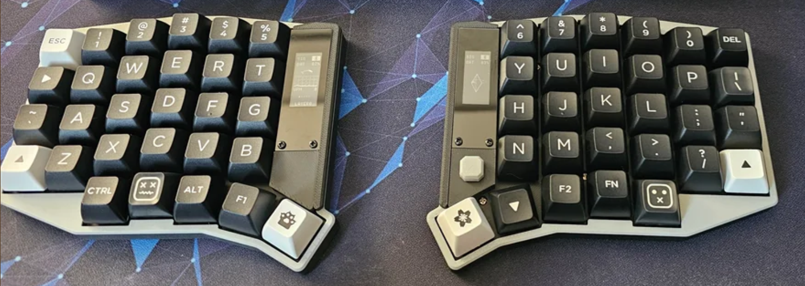
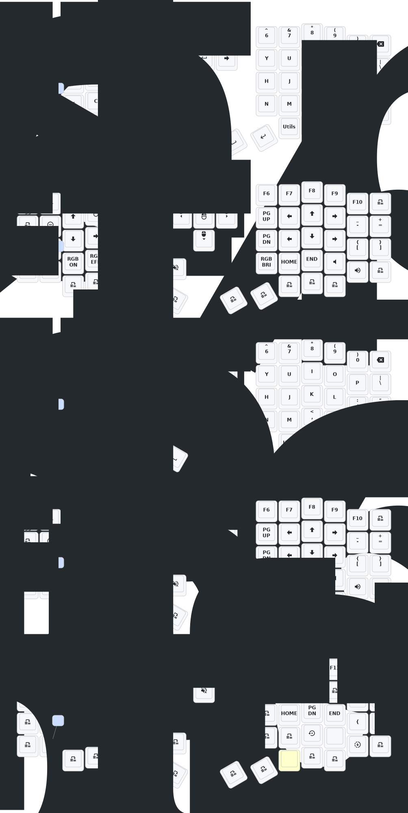

# Sofle v2 low-profile Wireless Mechanical Keyboard

This repo contains the ZMK firmware for the Sofle v2 low-profile wireless mechanical keyboard, which is an enhanced version of the original Sofle keyboard. The keyboard features a low-profile design, wireless connectivity, and a built-in display on the right-hand side.



This keyboard can be found on many vendors from AliExpress.

## Documentation

- [ZMK Firmware](https://zmk.dev/docs)

## Building and Flashing

All changes pushed to the repository trigger a build in GitHub Actions. You can download the latest firmware artifacts from the [Actions tab](https://github.com/carlosedp/zmk-sofle/actions/workflows/build.yml).

Download the generated `.zip` file and extract the three `.bin` files. One is the settings reset firmware that can be used to reset the keyboard settings if needed (same for both sides). The other two files are the left and right keyboard firmwares.

Press switch inside the circular hole on the back of the keyboard to reset.

Double clicking it will enter the Bootloader state. A drive will be shown in your computer where you can copy the corresponding `.bin` or `.uf2` file to flash the keyboard. Do this for both sides.

The toggle switches on the top and bottom of the left and right keyboards are both turned to the outer side, which is the battery switch.

If changing just the keymap or settings, flashing only one side (usually the left) is sufficient.

## Building Locally

```sh
git clone https://github.com/carlosedp/zmk-soufle.git
cd zmk-soufle

podman run -it --rm --security-opt label=disable --workdir /zmk -v $(pwd):/zmk -v /tmp:/temp docker.io/zmkfirmware/zmk-build-arm:4.1-branch /bin/bash

west init -l config && west update

export "CMAKE_PREFIX_PATH=/zmk/zephyr:$CMAKE_PREFIX_PATH"

# Build left half
west build -d ./build/left -p \
  -b "eyelash_sofle_left" \
  -s /zmk/zmk/app \
  -S studio-rpc-usb-uart \
  -- -DSHIELD="nice_view_gem" -DCONFIG_ZMK_STUDIO=y -DCONFIG_ZMK_STUDIO_LOCKING=n \
  -DZMK_CONFIG="/zmk/config" \
  -DZMK_EXTRA_MODULES="/zmk/eyelash_sofle"

# Build right half
west build -d ./build/right -p \
  -b "eyelash_sofle_right" \
  -s /zmk/zmk/app \
  -- -DSHIELD="nice_view_gem" \
  -DZMK_CONFIG="/zmk/config" \
  -DZMK_EXTRA_MODULES="/zmk/eyelash_sofle"

# Settings Reset
west build -d ./build/settings_reset -p \
  -b "nice_nano_v2" \
  -s /zmk/zmk/app \
  -- -DSHIELD="settings_reset" \
  -DZMK_CONFIG="/zmk/config" \
  -DZMK_EXTRA_MODULES="/zmk/eyelash_sofle"

# The resulting .bin files will be located in the respective build directories:
# ./build/left/zephyr/zmk.uf2
# ./build/right/zephyr/zmk.uf2
# ./build/settings_reset/zephyr/zmk.uf2
```

To flash the firmware, follow the same procedure as described in the "Building and Flashing" section above, using the generated `.uf2` files.

## Update List

- 2024/12/21
  1. Added support for zmk-studio (just refresh the left hand to use).
- 2024/10/24
  1. Modified power supply mode to reduce power consumption.
  2. Fixed the automatic shut-off feature for RGB power supply.
- 2025/8/22
  1. update the soft off.When you press the keys Q, S and Z simultaneously and hold them for 2 seconds, the keyboard will enter a deep sleep state and cannot be awakened by pressing the keys. This function can be used when carrying it outside. The activation method is to press the reset switch once.
  2. This month, I also updated the ultra-thin versions of the corne and sofle cases. The frame and base plate have been thickened, and the opening of the reset switch has been adjusted, so that the reset switch can be easily pressed. At present, we are still conceptualizing how to design the shell with an inclined bracket.If you have carefully examined a PCB, you will notice that there are reserved interfaces for expansion IO. I wonder if anyone has been able to utilize them,I will try it！
  3. The GIF animations on the right-hand keyboard screen have been removed, which will significantly reduce the powear consumption of the right-hand keyboard.

> If your  sofle was updated before 2025/8/22, please update to the latest firmware.
>

## Contact Me

For 3D printed model files or any issues and malfunctions with the keyboard, please contact [380465425@qq.com](mailto:380465425@qq.com)

## Sofle Keymap


